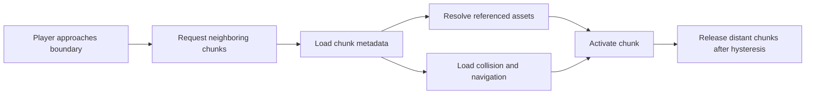

# World and Editor Architecture Improvements

Status: foundation implemented; acceptance hardening and broader workflows continue.

This document defines the next foundation for Neura's environment editor and
game runtime. It covers rendering order, elevation, Figma-like editor layers,
selection, collision authoring, chunked maps, lazy loading, and release asset
packaging.

It should be read with:

- [Environment foundation](environment-foundation.md)
- [Other Worlds character system](characters.md)
- [Environment importer](../tool/environment_importer/README.md)

## Goals

- Make low vegetation such as Grass 021 render correctly below actors and
  large objects.
- Keep physical elevation separate from visual sorting overrides.
- Provide Figma-like organizational layers with grouping, visibility, locking,
  and bulk operations.
- Make hover, click, overlap cycling, and marquee selection visually precise.
- Define collision around an object's physical base rather than its sprite
  dimensions.
- Grow from one small document to a streamed, finite open world.
- Load only visible chunks and the assets referenced by those chunks.
- Preserve a deterministic path from editor content to a sandboxed release
  bundle.

## Non-goals

- Arbitrary manual sprite ordering as the primary solution to spatial sorting.
- Pixel-perfect collision generated from sprite opacity.
- Loading the entire imported asset library or world at runtime.
- Implementing infinite procedural terrain in the first open-world version.
- Building a full navmesh system before basic chunked collision is proven.

## Original prototype behavior and limitations

The original runtime placed every environment object and the player in one
scene list and sorted it by `x + y`. That worked for ordinary trees, buildings,
and actors whose logical position was their point of contact with the ground.
It failed for flat details: grass positioned nearer the bottom drew after the
player, buildings, and trees even though it belonged to the ground.

`PlacedEnvironmentObject.z` was serialized but unused by the renderer. The
editor selected the nearest object anchor and highlighted a small ground
diamond rather than the complete visible object. The world was stored as one
document, and terrain strokes replayed during every render.

These are prototype constraints, not behaviors to preserve.

## Core terminology

| Concept | Responsibility | Example |
| --- | --- | --- |
| Terrain elevation | Physical height of the ground or walkable surface | Hill, upper floor |
| Object vertical offset | Height above the supporting surface | Object on a table |
| Render band | Broad semantic rendering pass | Ground cover, depth-sorted world |
| Spatial depth | Front/behind relationship inside a render band | Tree root below character |
| Sort bias | Small exceptional correction to spatial depth | Misaligned source anchor |
| Editor layer | Authoring organization, visibility, locking, grouping | Vegetation group |
| Selection shape | Region used to hover and select an object | Sprite silhouette or bounds |
| Footprint | Object's occupied ground region | Building base rectangle |
| Collider | Geometry that blocks or constrains movement | Tree-trunk circle |
| Walkable surface | Geometry actors may stand or move on | Bridge deck |

These concepts must remain separate in the data model. In particular, editor
layer order and physical elevation must not become generic substitutes for
spatial depth.

## Rendering model

### Render bands

The scene should render in semantic passes:

1. `terrain`: base terrain surfaces.
2. `terrainDetail`: painted material decals, paths, and flat markings.
3. `groundCover`: short grass patches, flowers, leaves, and other details that
   should remain below actors and large props.
4. `depthSorted`: characters, NPCs, trees, bushes, rocks, fences, buildings,
   and other objects ordered by position.
5. `overhead`: optional roofs, canopy overlays, weather occluders, or elements
   deliberately above the depth-sorted scene.
6. `effects`: particles, interaction indicators, and editor overlays.

The imported asset catalog should provide a default render band. Initial
category defaults are:

| Category | Default render band |
| --- | --- |
| Ground material | `terrain` / `terrainDetail` |
| Grass | `groundCover` |
| Bush | `depthSorted` |
| Rock | `depthSorted` |
| Tree | `depthSorted` |
| Fence and dock | `depthSorted` |
| Building | `depthSorted` |

Grass 021 should therefore render before all actors, trees, and buildings.
Elevation should not be changed to solve this problem.

Some future tall-grass assets may need to obscure only an actor's lower legs.
They can use one of three explicitly authored strategies:

- classify the asset as `depthSorted` when its entire sprite behaves like a
  normal prop;
- split it into background and foreground parts;
- define a small foreground occlusion region.

The first implementation only needs `groundCover` and `depthSorted`.

### Depth sorting

Actors and ordinary world objects share the `depthSorted` band. The initial
depth key remains:

```text
depth = sortAnchor.x + sortAnchor.y + sortBias
```

The sort anchor normally corresponds to the object's contact point with the
ground. It is distinct from the image pivot: the pivot aligns pixels while the
sort anchor describes spatial ordering.

For most props, correct anchors are sufficient. Buildings and other large
objects additionally need a ground footprint. A later footprint-aware sorter
may establish ordering constraints between overlapping objects. Until then,
an asset default and small per-instance `sortBias` provide an escape hatch.

Manual bias must remain exceptional. The editor should display a warning when
an instance uses a non-zero bias so visual corrections do not become invisible
scene debt.

### Elevation

Elevation represents physical world height:

```text
objectZ = supportingSurfaceZ + verticalOffset
screenY = projectedGroundY - objectZ * elevationPixelScale
```

An object placed on terrain normally samples that terrain's elevation.
`verticalOffset` is manually editable for objects on tables, platforms,
balconies, stairs, or unusual compositions.

Elevation must not determine whether a nearby tree is in front of a building.
That relationship comes from spatial depth and footprint metadata.

Bridges and multi-level interiors require multiple walkable surfaces at the
same `x, y`, each with a distinct surface ID and elevation. This is a later
extension of the same model, not a separate ordering hack.

## Figma-like editor layers

Editor layers organize authored content. They provide:

- custom names;
- nested groups;
- show/hide state;
- lock/unlock state;
- expand/collapse state in the layer tree;
- drag-and-drop grouping;
- bulk selection and transformation;
- optional color labels;
- optional export exclusion for development-only helpers.

Suggested starter hierarchy:

```text
World
  Terrain helpers
  Ground cover
  Vegetation
    Trees
    Bushes
  Structures
  Buildings
  NPCs
  Gameplay
    Colliders
    Triggers
    Spawn points
```

Layer visibility and locking are editor state that should be saved in the
world. Collapse state may remain user-local UI state.

### Layer order versus render order

The layer tree does not normally override render bands or spatial depth.
Moving `Vegetation` above `Buildings` must not cause every distant tree to
render over every nearby building and actor.

The layer tree may display objects in their current visual order and provide a
rare sort-bias control for an individual instance. If we later add explicit
layer ordering inside a render band, it must be opt-in and clearly identified
as a rendering rule rather than ordinary grouping.

### Proposed editor-layer model

```json
{
  "id": "layer_vegetation",
  "name": "Vegetation",
  "parentId": "layer_world",
  "visible": true,
  "locked": false,
  "exported": true,
  "color": "#5E9B68"
}
```

Each placed object stores `editorLayerId`. Deleting a non-empty layer should
require moving its contents or deleting them explicitly.

## Selection and inspection

### Editor modes

The primary modes should be explicit:

- Paint
- Place
- Select
- Collision edit
- Optional terrain-elevation edit

Keyboard shortcuts may temporarily switch modes, but the current mode must
always be visible.

### Hover behavior

In Select mode, hovering should:

- hit-test visible, unlocked objects under the pointer;
- highlight the complete object rather than only its anchor cell;
- show its name and editor layer;
- display its footprint when geometry visualization is enabled;
- show a stack indicator when several objects overlap.

Selection highlighting should use a generated silhouette, alpha mask, or
sprite tint. Collision geometry is not the visual highlight because a tree's
trunk collider is intentionally much smaller than its visible canopy.

The importer can generate a low-resolution alpha mask or outline with every
thumbnail. A bounding polygon is sufficient for the first version; detailed
alpha hit-testing can follow if needed.

### Click and overlap behavior

- Click selects the visually topmost eligible object.
- Repeated click or a dedicated overlap list cycles through objects under the
  pointer.
- Shift-click adds or removes one object from the selection.
- Escape clears selection.
- Locked and hidden layers are excluded from hit-testing.

The inspector should list overlapping candidates in visual order so the user
can select a grass patch beneath a tree without hiding the tree first.

### Marquee selection

Dragging empty space in Select mode creates a screen-space marquee similar to
Figma or an operating-system file manager.

Selection policy:

- default: select objects whose selection shapes intersect the marquee;
- modifier: require complete containment;
- Shift: add to the existing selection;
- platform toggle modifier: add/remove individual intersections.

Moving a multi-selection preserves relative world positions. Rotation and
future scaling should use a visible group pivot and apply only when supported
by every selected object.

The sidebar should show the selected instances grouped by editor layer, with
controls for visibility, lock state, move-to-layer, delete, and individual
focus.

## Asset geometry and collision authoring

Collision belongs to an asset definition and is transformed by each placed
instance. It must not be inferred directly from sprite dimensions or opacity.

### Geometry roles

An asset may define several independent geometry sets:

- `footprint`: occupied ground region used for selection and sorting;
- `blocking`: shapes an actor cannot enter;
- `walkable`: surfaces an actor may stand on, such as a bridge deck;
- `interaction`: door, harvest, dialogue, or use regions;
- `occluder`: optional line-of-sight or roof behavior;
- `selection`: optional authored selection region when generated bounds are
  inadequate.

### Shape types

The first collision editor should support:

- circle;
- ellipse;
- axis-aligned or oriented rectangle;
- polygon;
- thin segment/capsule for fences.

Examples:

| Asset | Recommended blocking geometry |
| --- | --- |
| Tree | Small circle/ellipse around trunk |
| Bush | None or small soft-cost region |
| Grass | None |
| Rock | Ellipse matching its ground contact |
| Fence | Thin polygon or capsule |
| Building | Polygon around walls, with door openings |
| Bridge | Walkable deck plus optional blocking rails |

### Collision editor

The asset collision editor should:

- display the sprite over an isometric measurement grid;
- edit canonical local-space shapes around the asset's base;
- show sort anchor, image pivot, footprint, and collider simultaneously with
  distinct colors;
- preview every supported direction;
- rotate reusable geometry where appropriate;
- allow per-direction overrides only when required;
- save edits in importer overrides or a dedicated geometry catalog;
- immediately preview character clearance with a standard actor-radius circle.

Trees therefore block only around their roots, not around the canopy or cast
shadow.

### Navigation foundation

Begin with a fine chunk-local navigation grid rather than a navmesh:

- cell size around 0.25-0.5 world units;
- rasterize blocking shapes into the navigation grid;
- expand obstacles by the actor radius;
- A* pathfinding across walkable cells;
- portal connections between neighboring chunks and elevation surfaces;
- optional movement-cost regions for bushes, mud, or shallow water.

This is easier to author, debug, rebuild incrementally, and stream than a
navmesh. A navmesh remains a future optimization if grid paths become a real
limitation.

## Chunked open-world model

Open world should mean a large, finite, streamed authored world—not one giant
document and not necessarily infinite procedural terrain.

### Chunk structure

Start with 32 x 32 world-unit chunks. Keep the size configurable so 64 x 64 can
be benchmarked later.

```text
worlds/village/
  world.json
  chunks/
    -1_0.json
    0_0.json
    1_0.json
    0_1.json
```

`world.json` contains:

- world ID, name, schema version, and global settings;
- chunk size and available chunk coordinates;
- player spawn and named travel points;
- references to global NPC or quest definitions;
- optional low-detail world preview data.

Each chunk contains:

- terrain elevation and material data;
- authoring strokes or baked paint-mask references;
- placed objects owned by the chunk;
- NPC placements and gameplay markers;
- collision/navigation data or generation inputs;
- referenced asset IDs;
- bounds for large objects crossing chunk borders.

Objects are owned by the chunk containing their sort anchor. Large footprints
remain discoverable from neighboring chunks through bounds metadata and are
not duplicated as independent instances.

### Terrain paint at scale

Replaying every brush stamp each frame will not scale. The editor may preserve
vector-like strokes for editing, but runtime output should be baked per chunk
as one of:

- composited ground texture;
- material-weight/splat masks;
- cached chunk render texture regenerated when the chunk changes.

Brush strokes crossing a chunk boundary must be split or indexed into every
affected chunk so editing either side remains deterministic.

### Runtime streaming

The initial runtime policy should:

- keep a 3 x 3 chunk neighborhood loaded around the player;
- begin preloading before the player reaches the active boundary;
- use a larger unload radius or delay to prevent boundary thrashing;
- load chunk JSON, terrain render data, objects, collision, and navigation
  asynchronously;
- reference-count images used by multiple loaded chunks;
- retain a bounded least-recently-used asset cache;
- cancel obsolete requests when the player changes direction quickly;
- never display an unloaded gap inside the reachable movement area.



The editor uses the same chunk repository but streams by viewport bounds
rather than player position. Dirty chunks save independently.

### Coordinate stability

Store positions as chunk coordinate plus local coordinate in serialized data.
Runtime systems may expose convenient world coordinates, but rendering and
physics should operate near a local origin. Origin rebasing can be introduced
if very large coordinates produce visible precision issues.

## Asset lifetime and release packaging

The imported catalog is an editor source library. Thumbnail browsing and full
sprite loading remain lazy and memory-bounded.

Runtime chunk activation should collect the chunk's referenced asset IDs and
acquire them through an asset repository. Deactivation decrements references;
zero-reference assets enter a bounded LRU cache before disposal.

Development builds may load generated images directly from the workspace.
Release builds must be self-contained and sandboxed. World export therefore
needs to:

1. traverse the world manifest and chunks selected for export;
2. resolve every referenced asset and required direction;
3. copy only those runtime images into the release asset bundle;
4. write a compact release catalog with workspace paths removed;
5. validate that no exported world reference is unresolved;
6. generate an asset-size report.

## Proposed data model

### Asset metadata

```json
{
  "id": "ow3.tree.006",
  "category": "Trees",
  "renderBand": "depthSorted",
  "pivot": {"x": 0.5, "y": 0.96},
  "sortAnchor": {"x": 0.0, "y": 0.0},
  "defaultSortBias": 0.0,
  "footprint": {
    "type": "ellipse",
    "center": {"x": 0.0, "y": 0.0},
    "radius": {"x": 0.45, "y": 0.32}
  },
  "collision": {
    "blocking": [
      {
        "type": "ellipse",
        "center": {"x": 0.0, "y": -0.03},
        "radius": {"x": 0.24, "y": 0.18}
      }
    ]
  }
}
```

### Placed object

```json
{
  "id": "object_1042",
  "assetId": "ow3.tree.006",
  "chunk": {"x": 3, "y": -1},
  "localPosition": {"x": 12.4, "y": 8.7},
  "surfaceId": "terrain",
  "verticalOffset": 0.0,
  "direction": "south",
  "editorLayerId": "layer_trees",
  "sortBias": 0.0
}
```

### Editor document additions

```json
{
  "editorLayers": [
    {
      "id": "layer_world",
      "name": "World",
      "parentId": null,
      "visible": true,
      "locked": false,
      "exported": true
    }
  ],
  "activeLayerId": "layer_world"
}
```

Selection and hover state are transient and must not be serialized.

## Schema migration

The next environment schema should migrate current documents predictably:

- existing ground strokes remain terrain details;
- Grass assets default to `groundCover` through catalog metadata;
- all other current objects default to `depthSorted`;
- current `z` becomes `verticalOffset` until terrain elevation exists;
- all objects enter a generated `World` editor layer;
- current pivots remain unchanged;
- `sortBias` defaults to zero;
- collision defaults come from importer profiles and remain visibly marked as
  unreviewed until confirmed in the collision editor.

Migration must preserve current object IDs and world positions.

## Implementation phases

### Current implementation status (2026-07-12)

- Phase 1 is implemented: catalog render bands, ground-cover separation,
  sort anchors and bias, physical vertical offsets, schema migration, importer
  validation, and editor controls are active in both editor and game.
- Phase 2 is implemented for the first production pass: persistent nested
  layers, visibility and locking, active-layer placement, full-sprite bounding
  selection, topmost overlap cycling and candidate lists, Shift selection,
  marquee selection, multi-object movement, grouped inspection, and layer
  reassignment are available and undoable. Existing groups can be reparented
  by drag-and-drop with cycle prevention, collapsed locally, and excluded from
  release export.
- Phase 3 is implemented: the catalog and persistent override file support
  circle, ellipse, rectangle, polygon, and capsule geometry; the editor can
  author footprints, blockers, walkable surfaces, and selection geometry; and
  preview every asset direction over a measurement grid with distinct pivot,
  sort-anchor, footprint, blocker, walkable, selection, and actor-clearance
  overlays. The game uses an actor-radius-expanded A* navigation grid.
- Phase 4 is implemented for the finite 256 x 256 prototype: deterministic
  32-unit chunk manifests, stable local coordinates, seam-indexed paint,
  cross-boundary object indices, async player/viewport streaming, hysteresis,
  cancellation, per-chunk dirty saves, asset reference counts, a bounded LRU
  decoded-image cache, and per-chunk terrain picture caches are active.
- Phase 5 is implemented: the Rust exporter traverses exported chunks and
  layers, writes compact catalogs with bundle-local paths, copies only the 13
  images referenced by the prototype, emits and enforces a byte report, and
  detects missing, stale, or unexpected release files. The game uses this
  self-contained package in every profile; the macOS release is sandboxed.
  The editor's Build release action saves dirty chunks and invokes the same
  deterministic Rust exporter.
- Phase 0 is implemented for the foundation: both apps provide F1–F5
  diagnostics from runtime geometry and ordering data, performance and cache
  counters, pause/step controls, seven named fixed-camera/clock/seed scenes,
  and `--debug-scene` launch support. The same fixtures are consumed by Flame
  lifecycle tests, and native macOS game/editor smoke workflows use Flutter's
  official integration-test runner. Focused semantic goldens and broader
  author-save-export-play workflows remain acceptance-hardening work.

### Acceptance evidence

| Foundation | Authoritative checks |
| --- | --- |
| Diagnostics | `apps/game/test/neura_game_lifecycle_test.dart`, `apps/editor/test/editor_game_lifecycle_test.dart`, and both native `integration_test/` smoke workflows load the same named JSON scenes used interactively |
| Rendering and movement | The game lifecycle suite asserts exact grass/actor/tree draw order and supported-direction movement; `apps/game/test/neura_game_test.dart` proves trunk, fence, and bridge navigation behavior |
| Layers and geometry | `apps/editor/test/editor_controller_test.dart` covers undoable hierarchy, reparenting, visibility, locking, export exclusion, multi-move, offsets, bias, and all geometry roles; widget tests exercise the geometry inspector |
| Chunking | `packages/neura_world/test/environment_chunks_test.dart` proves seam paint, stable local coordinates, large-object overlap indices, 3 x 3 streaming, hysteresis, reference counts, and cancellation; the Flame suite renders across repeated seams while asserting bounded cache state and uninterrupted navigation |
| Release | `cargo run --manifest-path tool/environment_importer/Cargo.toml -- check` verifies source assets, catalog, geometry, chunks, references, exact release files, and byte budget; `packages/neura_assets/test/environment_release_test.dart` decodes every release image and rejects editor-family leakage |

The macOS game integration test runs with the debug profile sandbox enabled.
A release build is additionally inspected for its app-sandbox entitlement and
contains only the compact environment release, named debug metadata, and the
two selectable character appearances.

### Phase 0: developer diagnostics and test harness

- Add `flame_test` to the game and editor development dependencies.
- Add deterministic debug-scene fixtures with fixed camera, player position,
  viewport, clock, and random seed.
- Add a project-specific debug HUD and geometry overlays.
- Extend the Rust validator to check world and catalog integrity.
- Add the Flutter SDK `integration_test` dependency when the first complete
  editor-to-game workflow is ready.

Acceptance gate: a developer can load a named regression scene, pause or step
it, inspect render/depth/geometry state, and reproduce the same result in an
automated test without manually recreating the scene.

### Phase 1: semantic rendering and elevation contract

- Add `renderBand`, sort-anchor, and sort-bias metadata.
- Render ground cover before the depth-sorted scene.
- Make Grass 021 and similar assets appear below actors and trees.
- Rename or reinterpret instance `z` as a physical vertical offset.
- Add catalog migration tests and render-order tests.

Acceptance gate: flat grass never paints over a character, tree, or building;
normal tree/actor ordering remains spatially correct.

### Phase 2: Figma-like layers and selection

- Add editor-layer hierarchy with visibility and locking.
- Add full-object hover highlighting.
- Implement topmost hit-testing and overlap candidate list.
- Add Shift selection and marquee selection.
- Add multi-selection inspector and move-to-layer operations.

Acceptance gate: a user can select a hidden-under-tree grass patch, marquee a
group, move it to a layer, hide/lock the layer, and undo every operation.

### Phase 3: geometry and collision editor

- Add footprints, selection shapes, blocking shapes, and walkable surfaces.
- Build the asset geometry editor.
- Add collision visualization to the world editor.
- Give the player a circular collider and prevent movement through authored
  shapes.
- Build a navigation grid for the current single map.

Acceptance gate: the character walks around a tree trunk while passing under
its canopy, cannot cross a fence, and can traverse a bridge deck.

### Phase 4: chunked world and streaming

- Add world manifest and chunk document schemas.
- Split terrain, objects, geometry, and navigation by chunk.
- Stream chunks by player position in the game and viewport in the editor.
- Add chunk dirty-state saving and cross-boundary object handling.
- Bake or cache terrain paint per chunk.

Acceptance gate: the player crosses several chunk boundaries without a visual
gap, navigation interruption, or unbounded memory growth.

### Phase 5: export packaging

- Traverse world/chunk asset references.
- Copy referenced images and generate a release catalog.
- Restore fully sandboxed release behavior.
- Add unresolved-reference and bundle-size validation.

Acceptance gate: a release build runs without repository access and includes
no unused imported asset families.

## Developer tooling and test harness

The project should use a small, intentional toolset. Most diagnostics must be
Neura-specific because generic inspectors do not understand render bands,
editor layers, chunk ownership, collision profiles, or workspace/release asset
lifetime.

### Dependencies

| Tool | Timing | Purpose |
| --- | --- | --- |
| [`flame_test`](https://pub.dev/packages/flame_test) | Add now | Deterministic Flame game sizing, lifecycle helpers, vector matchers, and focused render tests |
| Flutter `integration_test` | Add when one end-to-end workflow exists | Run the real desktop app and verify complete editor/game behavior |
| Flutter and Flame DevTools | Already available | CPU, memory, frame timeline, component tree, pause, and step inspection |
| Rust environment validator | Extend incrementally | Validate catalogs, worlds, chunks, geometry, and release references |

`flame_test` should remain a development dependency. The official Flutter SDK
`integration_test` package should also remain a development dependency and run
on macOS for the desktop authoring workflow.

References:

- [Flame testing guide](https://docs.flame-engine.org/latest/development/testing_guide.html)
- [Flame debug features](https://docs.flame-engine.org/latest/flame/other/debug.html)
- [Flutter integration testing](https://docs.flutter.dev/cookbook/testing/integration/introduction)
- [Flutter DevTools](https://docs.flutter.dev/tools/devtools)

### Neura debug HUD

A debug-only HUD should be available in both editor and game. Suggested
keyboard toggles:

| Shortcut | Overlay |
| --- | --- |
| F1 | Diagnostics panel |
| F2 | Render bands, sort anchors, depth keys, and sort bias |
| F3 | Image pivots, selection shapes, footprints, and collision geometry |
| F4 | Chunk boundaries, active/preload/unload radii, and chunk ownership |
| F5 | Navigation cells, blocked cells, portals, current target, and path |

The diagnostics panel should report:

- Flame FPS, frame time, update time, and render time;
- player world, chunk, and local coordinates;
- hovered and selected object IDs;
- hovered object's render band, editor layer, and depth key;
- visible and depth-sorted object counts;
- loaded, preloading, and pending-unload chunks;
- decoded source images and estimated bytes;
- thumbnail and runtime cache entries, bytes, hits, misses, and evictions;
- pending and cancelled asset requests;
- current navigation path length and expanded-node count.

Debug rendering must use the same geometry and ordering data as the runtime.
Do not maintain a separate approximate representation that can disagree with
gameplay.

Flame already provides `debugMode`, FPS components, timing components, and a
DevTools extension with component-tree inspection and pause/step controls. Use
those facilities where they fit, then add only the Neura-specific overlays they
cannot provide.

### Deterministic debug scenes

Every important bug or architectural rule should have a small fixture under a
dedicated directory, for example:

```text
debug_scenes/
  grass_below_actor.json
  tree_actor_depth.json
  tree_building_overlap.json
  overlapping_selection.json
  marquee_selection.json
  tree_trunk_collision.json
  bridge_surface.json
  chunk_boundary.json
  chunk_streaming_reversal.json
```

A fixture should define:

- world/chunk data;
- viewport dimensions and camera position;
- player position and facing;
- deterministic clock or requested animation frame;
- fixed random seed;
- expected loaded chunks and relevant object IDs;
- optional assertions specific to the scenario.

Both desktop entry points accept `--debug-scene=<name>`. For example, a built
game executable can open `grass_below_actor`, while the editor can open
`overlapping_selection` with its relevant object stack already selected.
F1–F5 toggle the diagnostics described above; `P` pauses/resumes and `.` steps
one deterministic 1/60-second update while paused.

The editor and game should both be able to launch a fixture directly from a
debug menu or command-line argument. Automated tests use the same files so a
failure can be reopened interactively without recreating it.

### Focused Flame tests

Use `flame_test` for rules that require a loaded game loop or deterministic
canvas size:

- render-band ordering;
- actor/tree front-behind transitions;
- camera projection and click-to-world conversion;
- fixed-timestep movement and animation direction;
- chunk activation and unload hysteresis;
- asset reference counting;
- collision visualization and geometry transforms;
- pause, step, and deterministic scenario loading.

Pure world-model, geometry, navigation, and migration logic should remain in
plain Dart unit tests where possible. Flame tests are for integration with the
game lifecycle, not a replacement for small unit tests.

### Golden-image strategy

Keep golden tests small and semantic. Do not golden-test entire artistic maps;
minor platform or texture differences would create noisy failures.

Recommended deterministic 400 x 300 or similarly small goldens:

- low grass below an actor;
- actor in front of and behind a tree;
- tree and building overlap;
- complete hovered-object highlight;
- marquee selection and multi-selection state;
- footprint/collision debug overlay;
- terrain and object continuity across one chunk seam.

Goldens should use a fixed viewport, animation frame, camera, random seed, and
small curated asset set. Logic assertions should accompany each image so a
failure explains the expected ordering or geometry, not only a pixel diff.

### End-to-end integration tests

Add native macOS integration tests after the relevant UI stabilizes. Priority
workflows are:

1. Open the editor, select an imported thumbnail, place an object, save, and
   reload it.
2. Export a world, launch the game, and confirm all referenced assets load.
3. Cross several chunk boundaries and verify activation/unloading counters.
4. Reverse direction near a boundary and confirm obsolete requests cancel
   without a visible gap.
5. Walk around a tree trunk, along a fence, and across a bridge surface.
6. Create a layer, move selected objects into it, hide/lock it, save, and
   restore the same state.

Integration tests should verify complete workflows, not duplicate every unit
test. Native permission dialogs are not currently part of these workflows, so
the Flutter SDK test package is sufficient.

### Rust validation

Extend `neura-environment-importer check` or add a sibling validator that can
fail CI when:

- a catalog ID, thumbnail, image, or directional view is missing;
- an object references an unknown editor layer, asset, surface, or chunk;
- collision polygons are self-intersecting, degenerate, or outside allowed
  numeric bounds;
- large-object bounds do not cover every chunk they overlap;
- navigation portals disagree across neighboring chunks;
- a release world retains a workspace-only asset path;
- referenced assets are absent from the release bundle;
- generated catalogs or chunk indices are stale;
- unexpected unused assets inflate the release bundle.

Validation output should identify the source document, object ID, asset ID,
and chunk coordinate needed to correct the problem.

### Tooling intentionally deferred

- Do not add `flame_forge2d` while movement uses static authored geometry and
  navigation rather than rigid-body physics.
- Do not add Tiled integration while Neura uses freeform painted materials,
  imported catalog metadata, and its own chunk/layer model.
- Do not add an ECS framework until actor/system complexity demonstrates a
  concrete need.
- Do not add third-party native UI testing while Flutter's official integration
  tests cover the required workflows.
- Do not add crash-reporting or analytics SDKs during foundation work.

## Testing and diagnostics

Every phase should include:

- deterministic JSON round-trip and migration tests;
- render-order unit tests using representative positions and bands;
- editor undo/redo tests for new operations;
- collision-shape transform and rasterization tests;
- chunk boundary and streaming cancellation tests;
- runtime counters for loaded chunks, decoded images, cache bytes, and pending
  requests;
- optional editor overlays for sort anchors, footprints, collision shapes,
  chunk boundaries, and navigation cells.

## Decisions to avoid

- Do not fix grass by assigning it a negative elevation.
- Do not derive collision from a sprite's full alpha bounds.
- Do not let editor group order silently replace spatial depth.
- Do not store one independently edited collider on every tree instance.
- Do not replay an unlimited history of paint stamps every runtime frame.
- Do not bundle the complete 194 MB source library into every game build.
- Do not begin with unrestricted manual z-order controls; use calibrated asset
  metadata and a visible, exceptional sort bias.

## Open decisions

These should be resolved through small prototypes and measurements:

- 32 x 32 versus 64 x 64 world-unit chunks.
- Exact terrain-elevation resolution and visual step height.
- Whether tall grass needs split sprites or only depth-sorted classification.
- Flat editor layers first versus nested groups immediately.
- Selection silhouette generation versus alpha-mask hit-testing.
- Navigation cell size after testing character movement near small props.
- How roof hiding and multi-level interiors interact with overhead render bands.
- Whether large-building footprint sorting is sufficient or requires explicit
  sprite slicing.

The recommended starting point is Phase 1. It fixes the observed grass issue
while establishing concepts used by every later system, without committing the
project prematurely to a large-map or collision implementation.
